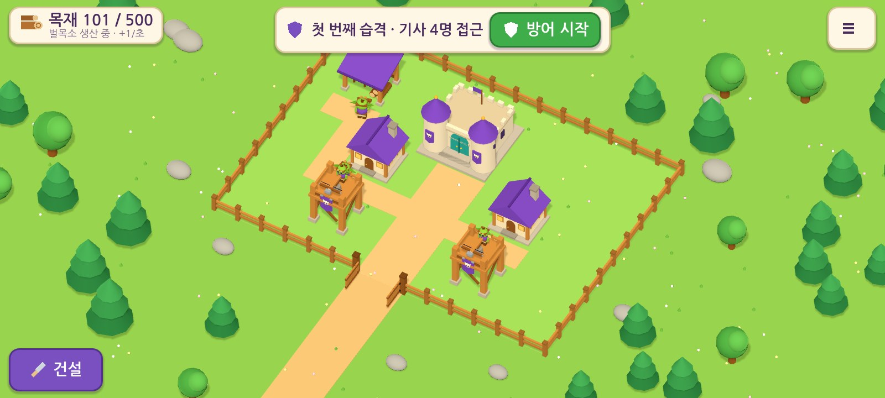

# 마물의 작은 마을: 첫 플레이 버전 (v0.1.0)

Android 휴대전화에서 가로 화면으로 즐기는 작은 마을 건설·방어 게임의 첫 플레이 버전입니다. 목재를 생산해 건설·배치를 하고, 인간 기사의 습격을 방어한 뒤 보상을 받아 다음 습격을 준비합니다.
제작 기준은 `docs/handoff-v1/`(전달받은 제작 묶음)입니다.

> **현재 상태: 구현과 APK 빌드는 끝났고, 실제 기기 검증은 하지 못했습니다.**
> 자동 검사와 데스크톱(가상 디스플레이) 실행으로 확인한 범위와 미검증 항목은 [`docs/TEST-REPORT.md`](docs/TEST-REPORT.md)에 구분해 두었습니다.

| 항목 | 내용 |
| --- | --- |
| 설치 파일 | [`release/monster-village-0.1.0-debug.apk`](release/monster-village-0.1.0-debug.apk) (**디버그용 APK**, 스토어 출시 파일 아님) |
| 패키지 ID | `io.github.kyusang4657.monstervillage` (후속 테스트 빌드에서도 유지) |
| 엔진 | Godot **4.4.1-stable** (공식 빌드) · GDScript · **Compatibility** 렌더러 · 실시간 3D |
| 지원 | Android 5.0(API 21)+, arm64-v8a / armeabi-v7a(저장소의 APK는 두 구조 모두 포함, 약 54MB. 대화로 전달한 `-arm64` APK는 64비트 전용 약 28MB이며 패키지·서명이 같음), 가로 화면(센서 가로), 오프라인 |
| 권한 | 추가 권한 없음(인터넷·위치·카메라·연락처 사용 안 함), 광고·결제·로그인 없음 |
| 실제 실행 화면 | [`docs/screenshots/`](docs/screenshots) (게임을 실행해 캡처한 화면, 이미지 시안 아님) |



## 1. 휴대전화에 설치하기

1. 휴대전화에서 `release/monster-village-0.1.0-debug.apk`를 내려받습니다(GitHub 저장소 파일 화면 → *Download raw file*).
2. 처음 설치할 때 Android가 "출처를 알 수 없는 앱" 설치 허용을 물으면, 내려받은 앱(브라우저·파일 앱)에 허용합니다.
3. 설치 후 **마물의 작은 마을** 아이콘으로 실행합니다. 인터넷 연결은 필요 없습니다.

PC에서 `adb`를 쓰는 경우에는 `adb install -r release/monster-village-0.1.0-debug.apk`로 설치합니다.

**업데이트:** 이후 테스트 빌드도 같은 패키지 ID와 같은 디버그 서명(`android/debug.keystore`)으로 만듭니다. 그래서 기존 앱을 지우지 않고 덮어 설치할 수 있고, 저장 데이터도 유지됩니다. 서명이 다른 빌드를 받았다면 설치가 거부될 수 있습니다. 이때 앱을 지우면 저장 데이터도 함께 지워지므로 먼저 확인하세요.

## 2. 조작법

| 동작 | 휴대전화 | PC(에디터·데스크톱 실행) |
| --- | --- | --- |
| 화면 이동 | 빈 땅을 한 손가락으로 끌기 | 왼쪽 끌기 / 오른쪽·가운데 버튼 끌기 |
| 확대·축소 | 두 손가락 벌리기·오므리기 | 마우스 휠 |
| 건물 선택 | 건물 탭 → 아래 정보 패널(옮기기·강화) | 클릭 |
| 건물 옮기기 | 정보 패널 **옮기기** → 건물을 끌거나 원하는 칸을 탭 → **회전** → **배치**(또는 **취소**) | 동일 |
| 새 건물 | 왼쪽 아래 **건설** → 고블린 주택(목재 30)·방어탑(목재 80) → 위치를 정하고 **배치 · 목재 N** | 동일 |
| 울타리 | **건설 → 울타리** → 땅을 끌어 선을 긋기(변 단위). 기존 내부 울타리를 탭하면 제거 표시, 다시 탭하면 해제 → **배치** | 동일 |
| 방어탑 강화 | 방어탑 선택 → **강화 · 목재 60**(Lv.2, 공격력 10→15) | 동일 |
| 습격 방어 | 위쪽 **방어 시작**(자동으로 시작하지 않음) | 동일 |
| 일시정지 | 전투 중 오른쪽 위 ‖ → **계속하기** | 동일 |
| 메뉴 | 오른쪽 위 ≡: 카메라 초기화, 새 게임, 그림자 켜기/끄기, FPS 표시 | 동일 |
| 뒤로 가기 키 | 편집 취소·창 닫기, 전투 중에는 일시정지(앱을 바로 종료하지 않음) | — |

배치가 가능하면 초록 바닥과 ✓ **배치 가능**이 표시됩니다. 불가능하면 빨간 바닥과 금지 아이콘, 그리고 이유(예: *다른 건물과 겹쳐요*, *성으로 가는 길을 남겨 주세요*)가 나오고 **배치** 버튼이 꺼집니다. 목재는 **배치를 누르는 순간 한 번만** 차감됩니다.

## 3. 구현 범위 요약

- 14×10 마을: 성 1, 주택 2, 벌목소 1, 방어탑 2, 바깥 울타리 46변과 폭 2칸의 열린 정문(`config/initial-layout.json` 좌표 그대로).
- 건물과 캐릭터는 모두 독립된 3D 오브젝트입니다. 아트 가이드의 고정 구조(성의 앞 탑 2개와 청록 양문, 주택의 뒤쪽 오른쪽 굴뚝, 벌목소의 외쪽지붕과 통나무 3개, 방어탑의 회전 석궁·조작 고블린·뒤쪽 사다리, 기사의 오른손 검·왼손 방패)를 기본 도형으로 만들었습니다. 그림 한 장을 배경으로 깔지 않았습니다.
- 셀 기반 배치, 90° 회전, 이동 미리보기와 취소·확정. 겹침·지도 밖·울타리 가로지름·성 경로 봉쇄를 검사합니다.
- 울타리는 칸 사이의 **변**을 막습니다. 드래그한 여러 변을 한 번에 미리 보고 확정하며, 중복 변은 과금하지 않고 제거해도 환급하지 않습니다.
- 목재는 VILLAGE·BUILD·RAID_READY 상태에서 초당 1씩 생산되고 상한은 500입니다. 전투·일시정지·결과 화면·백그라운드에서는 멈추고, 오프라인 소득은 없습니다.
- 습격 3단계(기사 4/6/8명, HP 90/105/120, 보상 40/60/80). 승리하면 마을에서 30~60초 대기 후 다음 예고가 나오고, 지면 같은 단계에 무료로 다시 도전합니다. 승패와 관계없이 성 체력은 복원되고 마을은 그대로 유지됩니다. 3단계 이후에는 수동 반복만 있습니다.
- 기사: (6.5,−2)에서 3초 간격으로 등장해 4방향 최단 경로로 성의 공격 칸까지 갑니다. 도착 1초 뒤부터 초당 6 피해를 줍니다.
- 방어탑: 사거리 4.5칸 안에서 가장 가까운 적(거리가 같으면 먼저 등장한 적)을 노립니다. 1.2초 간격으로 초속 8칸의 화살을 쏘며, 석궁과 조작자가 표적 방향으로 돌아갑니다.
- 15초 동안 진행이 없으면 보상 없이 준비 상태로 복구하고, 경로를 잃은 경우도 같은 방식으로 처리합니다.
- 일시정지와 백그라운드 처리: 복귀해도 자동으로 재개하지 않고 **계속하기**를 기다리며, 지나간 시간을 몰아서 적용하지 않습니다.
- 로컬 저장: 임시 파일에 쓴 뒤 검증하고 교체하며, 정상 백업을 하나 둡니다. 전투 시작 직전 상태를 스냅샷으로 저장하고, 전투 ID마다 보상은 한 번만 지급합니다.

## 4. 프로젝트 구조

```
project.godot / export_presets.cfg     Godot 프로젝트·Android 내보내기 설정
config/                                수치(prototype-defaults.json)·초기 배치(initial-layout.json) — 단일 기준
scenes/main.tscn                       시작 장면
scripts/core/   game_config.gd         JSON 설정 읽기
                grid_logic.gd          격자 점유·울타리 변·경로(BFS)·배치 검증
                game_state.gd          확정 상태·경제·건설·강화·습격 상태 머신·저장 형식/검증
                battle_sim.gd          고정 간격(1/60초) 결정적 전투 시뮬레이션
                save_manager.gd        원자적 저장·백업·복구
scripts/world/  world_view.gd          3D 장면(지면·장식·울타리·건물·전투 연출·카메라)
                models.gd, mesh_batch.gd  기본 도형 모델(객체당 한 메시로 합쳐 모바일 그리기 호출 절감)
scripts/ui/     hud.gd, ui_icon.gd     한국어 UI(아이보리 패널·보라/초록 버튼, 아이콘은 코드로 그림)
scripts/main.gd                        흐름·입력(탭/드래그/핀치)·저장 시점·앱 상태
scripts/debug/shot_driver.gd           실행 화면 자동 캡처(내보내기에서 제외)
tests/run_tests.gd                     헤드리스 규칙·밸런스 검사(123개)
tests/integration_driver.gd            실제 장면 통합 검사(27개)
assets/fonts/                          나눔고딕(OFL, assets/fonts/OFL.txt)
android/debug.keystore                 테스트 빌드용 디버그 서명(공개용 표준 디버그 키, 출시 키 아님)
release/                               디버그 APK
docs/handoff-v1/                       전달받은 원본 제작 묶음(참고 이미지 포함)
docs/screenshots/                      실제 실행 화면
docs/TEST-REPORT.md                    검수표 결과
```

## 5. 빌드와 검사 방법

### 필요한 도구(이번 빌드에 실제 사용한 것)

| 도구 | 버전·비고 |
| --- | --- |
| Godot | 4.4.1-stable 공식 Linux 빌드(`Godot_v4.4.1-stable_linux.x86_64`) |
| 내보내기 템플릿 | 4.4.1.stable 공식 템플릿 중 `android_debug.apk` / `android_release.apk` |
| 내보내기 방식 | **Gradle을 쓰지 않는 기본 템플릿 내보내기**(`gradle_build/use_gradle_build=false`) |
| 서명 | apksigner 0.9(Ubuntu `apksigner` 31.0.2 패키지), zipalign(Ubuntu 패키지) |
| Java | OpenJDK 21(apksigner 실행용) |
| Android SDK | 빌드 환경에서 Google SDK 서버 접근이 막혀 있었습니다. 그래서 `platform-tools/adb`와 `build-tools/34.0.0/apksigner`만 연결한 최소 SDK 폴더를 Godot 편집기 설정에 지정했습니다. |

Godot 공식 문서가 안내하는 표준 환경(OpenJDK 17 + Android SDK 설치)에서도 같은 프리셋으로 내보낼 수 있습니다. Gradle 빌드(AAB·플러그인)가 필요해지면 표준 SDK를 설치해야 합니다.

### 명령

```bash
# 1) 리소스 가져오기(최초 1회)
godot --headless --path . --import

# 2) 규칙·밸런스 자동 검사(디스플레이 불필요)
godot --headless --path . --script res://tests/run_tests.gd

# 3) 실제 장면 통합 검사(디스플레이 필요: 데스크톱 또는 xvfb-run)
xvfb-run -a godot --path . --rendering-driver opengl3 --resolution 1280x720 -- \
    --integration --save-dir=user://itest/ --fresh --no-focus-pause

# 4) 실행 화면 캡처
xvfb-run -a godot --path . --rendering-driver opengl3 --resolution 1600x720 -- \
    --shots=/tmp/shots --save-dir=user://shots/ --fresh --no-focus-pause

# 5) 디버그 APK
#    편집기 설정(~/.config/godot/editor_settings-4.4.tres)에 다음을 지정:
#    export/android/android_sdk_path, export/android/java_sdk_path,
#    export/android/debug_keystore = <저장소>/android/debug.keystore
#    export/android/debug_keystore_user = androiddebugkey, export/android/debug_keystore_pass = android
godot --headless --path . --export-debug "Android" build/android/monster-village-debug.apk
```

`--save-dir`, `--fresh`, `--shots`, `--integration`은 검사용 인자입니다. 일반 실행에서는 쓰이지 않습니다.

## 6. 저장 데이터

- 위치: Godot `user://`. Android에서는 앱 내부 저장소(`/data/data/io.github.kyusang4657.monstervillage/files/`)이고, Linux 데스크톱에서는 `~/.local/share/godot/app_userdata/마물의 작은 마을/`입니다.
- 파일: `save.json`(현재), `save.bak.json`(직전 정상본), 쓰는 중에 생기는 임시 파일 `save.tmp.json`, 그리고 `settings.cfg`(그림자·FPS 표시 설정).
- 저장 시점: 배치·강화·울타리 확정 직후, 전투 시작 직전(준비 상태 스냅샷), 결과 확정 시, 앱이 배경으로 갈 때, 마을에서 시간이 흐르는 동안 5초마다.
- 손상 처리: 저장값의 범위·종류·중복 ID·점유·경로를 검사합니다. 문제가 있으면 백업으로 복구하고, 복구할 수 없으면 기존 파일을 `save.broken.json`으로 보존한 뒤 새 마을로 시작한다고 알립니다.
- **초기화:** 게임 안 메뉴(≡) → **새 게임** → 확인. 또는 Android 설정 → 앱 → 마물의 작은 마을 → 저장공간 → 데이터 삭제.

`save.json` 예(버전 1):

```json
{
  "version": 1,
  "buildings": [{"id": "castle_01", "type": "castle", "x": 5, "z": 6, "rot": 0, "level": 1}, "..."],
  "interior_fences": ["v:11:6"],
  "wood": 140, "wood_frac": 0.42,
  "ready_stage": 2, "highest_cleared": 1,
  "raid_ready": false, "raid_timer": 37.5,
  "last_resolved_battle_id": 1, "battle_seq": 1,
  "rng_seed": 123, "rng_state": "..."
}
```

- `x, z`: 점유 영역의 최소 모서리 칸. `rot`: 위에서 볼 때 시계 방향 90° 단위(0~3).
- 울타리 변 키: `h:x:z`는 격자점 (x,z)–(x+1,z) 가로 변이고, `v:x:z`는 (x,z)–(x,z+1) 세로 변입니다. 내부 변만 저장합니다(바깥 46변과 정문은 고정).
- `battle_seq`는 시작한 전투 수이고, `last_resolved_battle_id`는 결과가 확정된 마지막 전투입니다. 같은 ID의 보상은 다시 지급하지 않습니다.

## 7. 원래 제안과 달라진 점

| 항목 | 변경 | 이유 |
| --- | --- | --- |
| `camera.initial_azimuth_degrees` | 45 → **30** | 45°에서는 가로 화면에서 정문과 접근로가 화면 왼쪽 아래 구석으로 치우치고, 마을 앞쪽 모서리가 잘렸습니다. 30°로 바꾸니 `village.png`처럼 정문이 화면 아래 가운데 쪽에 오고, 1280×720과 1600×720 모두에서 마을 전체가 보였습니다. 고도 50°는 그대로입니다. |
| 전투·경제 수치 | 변경 없음 | 기본 수치로 P01(기본 배치 승리)과 P02(먼 배치 패배)가 성립했습니다. |

전체 결과와 근거는 [`docs/TEST-REPORT.md`](docs/TEST-REPORT.md)를 보세요.

## 8. 남은 문제와 다음 할 일

- **실기기 검증을 하지 못했습니다.** 설치, 터치 감도, 두 손가락 확대, 노치 안전 영역, 글자 가독성, 30FPS, 10분 연속 플레이, 발열은 사용자 휴대전화에서 확인해야 합니다. 느리면 메뉴에서 **그림자 끄기**를 먼저 시도하고, **FPS 표시**로 측정해 주세요.
- 모델은 기본 도형으로 만든 임시 입체 모델입니다. 구조와 색은 기준 시트를 따랐지만 세부 장식(창틀, 문양 등)은 단순화했습니다. 애니메이션은 걷기, 공격, 피격 깜빡임, 쓰러짐 정도로 간단합니다.
- 소리와 음악이 없습니다.
- 디버그 APK라서 출시용 서명, AAB, 스토어 등록은 범위 밖입니다.
- APK 크기를 줄이려고 Godot의 선택 텍스트 데이터(ICU 줄바꿈 사전, 약 2.8MB)는 넣지 않았습니다. 한글 글자 조합에는 영향이 없고 줄바꿈은 띄어쓰기 기준으로 됩니다. 실기기에서 긴 안내 문장이 어색하게 끊기면 `project.godot`에 `locale/include_text_server_data=true`를 다시 넣어 주세요.
- 밸런스 참고: 2단계는 Lv.1 탑 두 개로 지고, 두 탑을 모두 강화하면 이깁니다. 3단계는 기본 배치로 지고, 탑 4개를 모두 Lv.2로 길 근처에 두면 이깁니다(성 HP 180/180). 재미와 난이도는 실제 플레이 의견을 받은 뒤 조정할 항목입니다.
