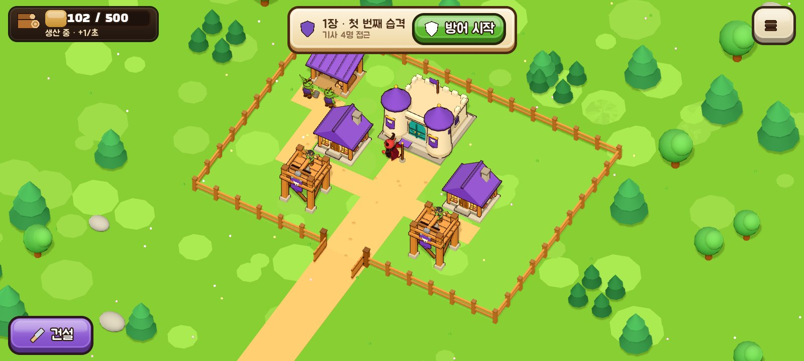
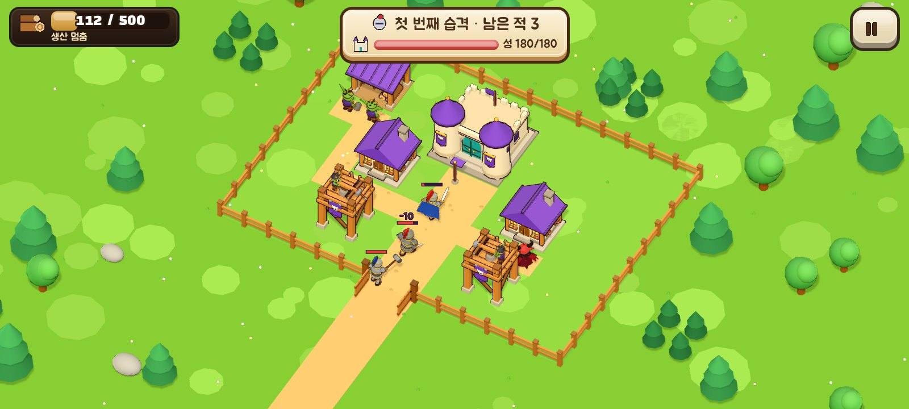
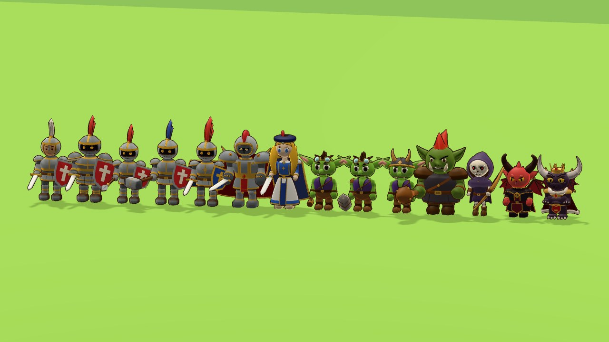
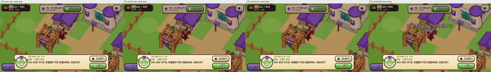

# 마물의 작은 마을

마물 진영의 작은 마을을 짓고 꾸미면서, 성을 노리는 인간 기사의 습격을 방어탑으로 막는 가로 화면 건설·방어 게임입니다. 습격을 막을수록 성이 자라고 땅이 넓어져, 작은 마을이 마왕성이 됩니다.

Godot 4.4.1 · GDScript · Compatibility 렌더러 · 오프라인 싱글플레이 · 서버·로그인·광고·결제·런타임 생성형 AI 없음 · 한국어

| 바로 해 보기 | |
| --- | --- |
| **브라우저** | https://kyusang4657.github.io/little-monster-village/ (PC: 끌기·마우스 휠, 휴대전화 브라우저: 터치. 첫 클릭 뒤에 소리가 납니다) |
| **Android** | [Releases](https://github.com/kyusang4657/little-monster-village/releases/latest) 의 APK (디버그 서명, arm64 전용 약 30MB / 범용 약 58MB, 추가 권한 없음) |







## 어떤 게임인가

- **건설:** 고블린 주택·방어탑·벌목소·앞마당·꽃밭·버섯 등불을 짓고 꾸밉니다. 일꾼이 현장까지 걸어가 공사하고, 울타리로 기사의 길을 바꿀 수 있습니다.
- **방어:** 습격 10단계(기사 5종, 마지막은 기사단장과 용사). 방어탑 강화, 해골 궁수·꼬마 오크 생산, 집결 깃발로 막습니다. 습격은 **방어 시작**을 눌러야 시작됩니다.
- **성장:** 장을 끝낼 때마다 성이 자라고(Lv.1~4) 땅을 넓힙니다. 주인공 뿔이는 성과 함께 악마형 마왕으로 자랍니다(왕관·홀·망토).
- **이야기와 안내:** 프롤로그·장·보스·엔딩 장면, 9단계 안내 말풍선, 패배 뒤 규칙 기반 조언, 도움 모드.

조작법과 규칙 설명은 [`docs/HISTORY.md`](docs/HISTORY.md) 2절에 있습니다.

## 기술적으로 볼 만한 것

- **수치 단일 기준:** 경제·건물·공사·전투·10단계·장·성 레벨 수치가 모두 [`config/`](config)의 JSON 에 있고 코드는 읽기만 합니다.
- **결정적 전투 시뮬레이션:** 규칙([`scripts/core/`](scripts/core))은 화면과 분리되어 같은 입력이면 같은 결과를 냅니다. 10단계 각각을 "그때까지 모을 수 있는 배치로 이길 수 있는지" 헤드리스로 자동 검사합니다(규칙 검사 637개).
- **절차적 캐릭터:** 외부 모델 파일 없이 코드로 메시·뼈대·표정·자세를 만듭니다. 6차에서는 "도형을 이어 붙인" 느낌을 진단하고 조각 구 머리·회전체 몸통·연속 팔다리 기법으로 전원 재구성했습니다(캐릭터당 메시 1개, 삼각형 예산 4,000/6,000, 리그 검사 520개). 컨셉 시트와 대조하는 심사 라운드 기록이 [`docs/design/`](docs/design)에 있습니다.
- **검사 체계:** 규칙 검사 637개, 캐릭터 검사 520개(모델 세트별), 실제 장면 통합 검사 100개(가상 디스플레이), 저장 데이터 v1→v4 자동 이전과 검증. `main` 푸시마다 GitHub Actions 가 검사 후 웹 빌드를 Pages 에 배포합니다.
- **직접 만든 자료:** 건물·캐릭터·아이콘은 코드, 효과음 12종과 배경음 2곡은 파형 합성(CC0), 글꼴은 OFL. 출처는 [`CREDITS.md`](CREDITS.md).

## 개발 과정

| 차수 | 내용 | 기록 |
| --- | --- | --- |
| 1차 | 격자 마을, 건설·이동·울타리, 습격 3단계, 저장, Android/웹 빌드 | [`docs/HISTORY.md`](docs/HISTORY.md) |
| 2차 | 공사 과정과 일꾼, 건물 꾸미기, 기사 분산·조언·도움 모드, 안내·소리·10단계 | [`docs/TEST-REPORT.md`](docs/TEST-REPORT.md) |
| 3차 | 장과 성 레벨, 땅 넓히기, 앞마당, 이야기 장면, 뼈대 캐릭터 | [`docs/DESIGN-v0.3.md`](docs/DESIGN-v0.3.md) |
| 4차 | 만화풍 화풍, 주인공 뿔이, 유닛 직접 생산 | [`docs/DESIGN-v0.4.md`](docs/DESIGN-v0.4.md) |
| 5차 | 캐릭터 컨셉 시트 기준 전면 리디자인과 심사 | [`docs/DESIGN-v0.5.md`](docs/DESIGN-v0.5.md), [`docs/design/v5/`](docs/design/v5) |
| 6차 | 매끈한 한 면 모델로 재구성, 악마형 마왕 Lv.1~4, 1.0.0 공개 | [`docs/design/v6/README.md`](docs/design/v6/README.md), [`docs/design/demon-lv1/README.md`](docs/design/demon-lv1/README.md) |



## 프로젝트 구조

```
config/                      수치·이야기·꾸미기 부품·초기 배치(JSON, 단일 기준)
scripts/core/                규칙: game_state, grid_logic(BFS), battle_sim, battle_advisor, save_manager, story
scripts/world/               3D: world_view, models(건물 조립), character_rig(관절·자세·표정), char_geo, chars/(캐릭터별 빌더)
scripts/ui/                  hud, tutorial, story_view, ui_icon(코드로 그린 아이콘)
scripts/main.gd              흐름·입력·저장 시점·앱 상태
tests/                       run_tests(규칙), character_checks(캐릭터), integration_driver(실제 장면), 캡처 도구
tools/                       소리 합성기, 캡처 몽타주, Android 빌드 템플릿 설치
docs/                        설계 결정, 검수 보고, 캐릭터 심사 캡처, 출시 안내, 스토어 자료
.github/workflows/build.yml  검사 + 웹 빌드 + GitHub Pages 배포
```

## 빌드와 검사

```bash
godot --headless --path . --import                                  # 최초 1회
godot --headless --path . --script res://tests/run_tests.gd         # 규칙 검사
godot --headless --path . --script res://tests/character_checks.gd  # 캐릭터 검사(--model-set=v5 로 5차 모델)
xvfb-run -a godot --path . --rendering-driver opengl3 --resolution 1280x720 -- \
    --integration --no-tutorial --no-story --save-dir=user://itest/ --fresh --no-focus-pause   # 통합 검사
godot --headless --path . --export-debug "Android" build/android/monster-village-debug.apk
godot --headless --path . --export-release "Web" build/web/index.html
```

Android 내보내기는 Godot 4.4.1 공식 템플릿과 공개 디버그 키(`android/debug.keystore`)를 씁니다. 캡처·성능 측정 명령과 Google Play 용 AAB(대상 SDK 36, Gradle) 절차는 [`docs/HISTORY.md`](docs/HISTORY.md) 6절과 [`docs/release/`](docs/release)에 있습니다.

## 상태와 한계

- 1.0.0 은 **포트폴리오 공개판**입니다. 자동 검사·가상 디스플레이·헤드리스 브라우저로 확인했고, **실제 휴대전화에서는 검증하지 못했습니다**(터치·노치·30FPS·발열·소리 품질). 확인 범위는 [`docs/TEST-REPORT.md`](docs/TEST-REPORT.md)에 구분해 두었습니다.
- Google Play 출시는 하지 않았습니다. 필요한 준비(AAB 프리셋, 출시 키, 양식)는 [`docs/release/GOOGLE-PLAY.md`](docs/release/GOOGLE-PLAY.md)에 정리되어 있습니다.
- 최대 지도·10단계에서 외곽선을 켜면 삼각형이 약 73만이라 느린 기기는 메뉴에서 외곽선·그림자를 끄는 편이 좋습니다.
- 저장 데이터는 Android `files/save.json`, 웹은 브라우저 IndexedDB 에 있습니다. 초기화는 메뉴 → 새 게임.

## 출처와 저작권

- 글꼴: 주아체·검은고딕(OFL), 기호 보조 글꼴은 나눔고딕에서 기호만 뽑은 수정본(OFL). 소리: 직접 합성, CC0. 모델·아이콘·대사: 이 프로젝트에서 직접 제작. 상세는 [`CREDITS.md`](CREDITS.md).
- 소스 코드의 라이선스 파일은 아직 두지 않았습니다(저작권은 저장소 소유자에게 있습니다).
