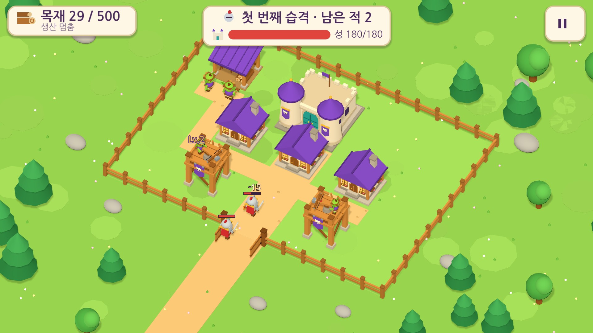
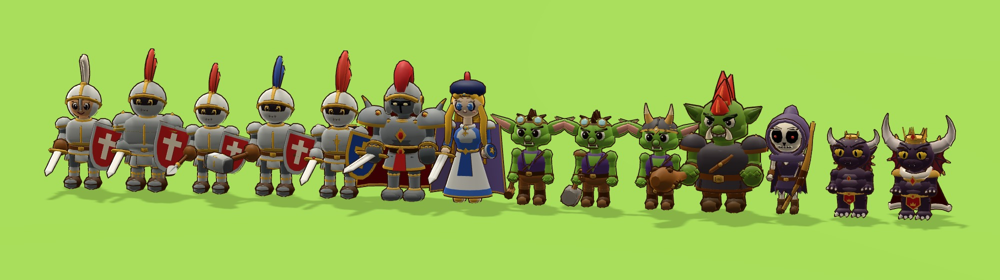

# 마물의 작은 마을 (v0.5.0)

마물 진영의 작은 마을을 짓고 꾸미면서, 성을 노리는 인간 기사의 습격을 방어탑으로 막는 가로 화면 건설·방어 게임입니다. 습격을 막을수록 성이 자라고 땅이 넓어져, 작은 마을이 마왕성이 됩니다. 오프라인 싱글플레이이며 서버·로그인·광고·결제·런타임 생성형 AI가 없습니다.

> **현재 상태: 5차(캐릭터를 컨셉 시트에 맞춰 전면 리디자인) 구현과 디버그 APK·웹 빌드는 끝났고, 실제 휴대전화 검증은 하지 못했습니다.**
> 자동 검사·데스크톱(가상 디스플레이)·헤드리스 브라우저로 확인한 범위와 미검증 항목은 [`docs/TEST-REPORT.md`](docs/TEST-REPORT.md)에 구분해 두었습니다.

| 항목 | 내용 |
| --- | --- |
| 설치 파일 | [`release/monster-village-0.5.0-debug.apk`](release/monster-village-0.5.0-debug.apk) (**디버그용 APK**, arm64-v8a + armeabi-v7a, 약 58MB) |
| 웹(itch.io용) | `godot --headless --path . --export-release "Web" build/web/index.html` → `build/web` 압축(약 12.7MB). 안내: [`docs/release/ITCH-IO.md`](docs/release/ITCH-IO.md) |
| 패키지 ID / 버전 | `io.github.kyusang4657.monstervillage` / 0.5.0 (versionCode 5). 이전 버전과 같은 디버그 서명이라 덮어 설치하면 저장이 이어집니다 |
| 엔진 | Godot **4.4.1-stable** · GDScript · **Compatibility** 렌더러 · 실시간 3D |
| 권한 | 추가 권한 없음(인터넷·위치·카메라·연락처 사용 안 함) |
| 출처·라이선스 | [`CREDITS.md`](CREDITS.md) (폰트 OFL, 모델·소리는 직접 제작, 소리는 CC0) |
| 5차 설계 결정 | [`docs/DESIGN-v0.5.md`](docs/DESIGN-v0.5.md) (컨셉 시트 기준 캐릭터 리디자인, 심사 점수, 남은 차이) |
| 4차 설계 결정 | [`docs/DESIGN-v0.4.md`](docs/DESIGN-v0.4.md) (화풍 규칙, 뿔이, 유닛·인구·집결 깃발과 균형) |
| 3차 설계 결정 | [`docs/DESIGN-v0.3.md`](docs/DESIGN-v0.3.md) (장·성 레벨·넓히기·앞마당·이야기·자유도 결정과 이유) |
| 출시 준비 | [`docs/release/`](docs/release) (itch.io, Google Play, 개인정보처리방침), [`docs/store/`](docs/store) (아이콘·대표 이미지·스크린샷·설명) |



## 1. 설치

1. 휴대전화에서 APK를 내려받습니다(GitHub 파일 화면 → *Download raw file*).
2. "출처를 알 수 없는 앱" 설치를 허용하고 설치합니다. 인터넷 연결은 필요 없습니다.
3. PC에서는 `adb install -r release/monster-village-0.5.0-debug.apk`로 설치합니다.

이전 버전 저장 데이터(형식 v1~v3)는 처음 실행할 때 v4로 자동 이전됩니다(유닛 0, 집결 깃발은 성 앞). 성 레벨은 이미 깬 단계에 맞춰지고, 이미 지나온 장의 이야기는 본 것으로 표시됩니다.

## 2. 조작법

| 동작 | 방법 |
| --- | --- |
| 화면 이동 / 확대·축소 | 빈 땅을 한 손가락으로 끌기 / 두 손가락 벌리기·오므리기(PC: 끌기, 마우스 휠) |
| 건물 선택 | 건물 탭 → 아래 정보 패널: **옮기기 · 강화 · 꾸미기** |
| 새 건물 | 왼쪽 아래 **건설** → 고블린 주택(목재 30)·방어탑(80)·벌목소(120)·앞마당(100)·꽃밭(5)·버섯 등불(10) → 자리 정하기 → **배치**. 일꾼이 와서 공사하고 완성. 잠긴 카드에는 "성 Lv.N 해금"이 보임 |
| 땅 넓히기 | **건설 → 땅 넓히기** → 방향 고르기 → 노란 땅 확인 → **넓히기**(성 Lv.2부터 동·서, Lv.3부터 북·남) |
| 앞마당 | 성 Lv.3부터, 넓힌 땅의 숲 자원 지점(노란 테두리)에만. 점령당하면 앞마당을 눌러 **수리**(목재 20) |
| 울타리 | **건설 → 울타리** → 땅을 끌어 선 긋기, 기존 내부 울타리를 탭하면 제거 표시 → **배치** |
| 방어탑 강화 | Lv.2(목재 60, 공격력 15) → Lv.3(목재 120, 공격력 22) |
| 꾸미기 | 정보 패널 **꾸미기** → 오른쪽 패널에서 부품 선택(바로 미리보기) → **완료**(무료) / **취소** |
| 습격 | 위쪽 **방어 시작**(자동으로 시작하지 않음). 전투 중 ‖ = 일시정지 |
| 유닛 | **건설 → 해골 막사**(Lv.1)·**오크 훈련장**(Lv.2) → 건물을 눌러 **훈련**(목재·시간, 주택 1채당 1명). 전투에 자동으로 나가 **집결 깃발**(건설 메뉴에서 옮기기) 근처에서 싸움 |
| 뿔이 | 마을을 걸어 다니는 주인공. 누르면 한마디, 성이 자라면 축하 |
| 메뉴 ≡ | 그림자·외곽선·FPS 표시, 도움 모드, 안내 다시 보기, **이야기 다시 보기**, 배경음·효과음 음량, 카메라 초기화, 새 게임 |
| 뒤로 가기 키 | 편집 취소·창 닫기, 전투 중에는 일시정지 |

처음 실행하면 짧은 프롤로그 뒤에 고블린 촌장 꼬블의 안내 말풍선 9단계(건설 → 배치 → 공사 → 강화 → 방어 시작)가 나옵니다. 이야기와 안내 모두 **건너뛰기**를 누를 수 있고, 메뉴에서 다시 볼 수 있습니다.

## 3. 5차에서 바뀐 것: 캐릭터를 컨셉 시트에 맞추기

사용자가 준 캐릭터 컨셉 시트 2장([`docs/design/concept/`](docs/design/concept))에 게임 캐릭터를 맞춰 전부 다시 만들었습니다. 설계와 심사 결과는 [`docs/DESIGN-v0.5.md`](docs/DESIGN-v0.5.md), 캐릭터별 캡처는 [`docs/design/v5/`](docs/design/v5), 게임 화면은 [`docs/screenshots/v0.5/`](docs/screenshots/v0.5)에 있습니다.



- **뿔이:** 흑자색 용 몸, 큰 회색 뿔, 금 왕관과 붉은 보석, 노란 눈에 세로 동공, 박쥐 날개, 가시 꼬리, Lv.3부터 붉은 털 망토. 지팡이는 없어졌습니다.
- **고블린 3종:** 이마 고글·보라 조끼·돌망치, 방어탑 조작수는 뿔 투구. **꼬마 오크:** 붉은 모히칸·엄니·징 몽둥이. **해골 궁수:** 둥근 두건 로브·붉은 눈·큰 활.
- **기사 5종:** 일반(열린 투구·흰 깃)·중갑(통투구·큰 어깨)·창기사·망치 기사·성기사(금 테·파란 망토). **보스:** 기사단장 번쩍경(닫힌 면갑·대검·붉은 망토), 용사 루루(금발·베레모·흰·파랑 드레스).
- 코드는 `char_geo.gd`(도형)와 `scripts/world/chars/*_builder.gd`(캐릭터별)로 나뉘었고, 삼각형 예산은 캐릭터 4,000 / 보스·뿔이 6,000입니다(config). 캐릭터는 부드러운 전용 재질(림 라이트)을 씁니다.
- 대화 얼굴 아이콘(뿔이·기사단장·루루)도 새 모델에 맞췄고, "웃음" 표정은 눈을 감습니다.

## 3-0. 4차에서 바뀐 것: 만화풍 화풍, 주인공 뿔이, 유닛 직접 생산

자세한 규칙과 이유는 [`docs/DESIGN-v0.4.md`](docs/DESIGN-v0.4.md), 화풍 규칙은 [`docs/design/style/`](docs/design/style), 뿔이 시안은 [`docs/design/imp/`](docs/design/imp)에 있습니다.

- **화풍:** 캐릭터·건물·울타리에 짙은 외곽선, 칠한 듯한 명암, 큰 주먹·장화·방패의 두툼한 비율. 젤리 버튼·양피지 창·자원 막대·외곽선 글자(주아체·검은고딕). 느린 기기는 메뉴에서 외곽선을 끌 수 있습니다.
- **뿔이(어린 마왕):** (4차 디자인은 5차에서 컨셉 시트 디자인으로 바뀜) 성 레벨에 따라 자라고, 마을을 산책하며 누르면 한마디, 성이 자라면 빛기둥과 함께 축하합니다.
- **유닛:** 해골 궁수(깃발 뒤에서 활), 꼬마 오크(깃발 줄에서 기사를 2명까지 막음). 쓰러져도 전투가 끝나면 돌아옵니다. 초반에 큰 도움이 되지만 후반은 방어탑이 꼭 필요하도록 맞췄습니다.

## 3-1. 3차 개발에서 바뀐 것: 마왕성으로 성장하기

자세한 규칙과 자유도 결정의 이유는 [`docs/DESIGN-v0.3.md`](docs/DESIGN-v0.3.md)에 있습니다.

### 3.1 장과 성 레벨 (A1)
- 1장 작은 마을(1~3), 2장 고블린 요새(4~6), 3장 어둠의 성채(7~9), 최종장 마왕성(10). 장을 끝낼 때마다 성이 한 단계 자랍니다.
- 성 Lv.1~4: HP 180 → 220 → 260 → 320. 레벨마다 모델이 커집니다(나무 말뚝·망루 → 검은 돌·빛나는 창 → 뿔·금빛 장식). 차지하는 칸과 기사 공격 칸은 그대로입니다.
- 레벨마다 열리는 것: 땅 넓히기 방향, 두 번째 벌목소, 주택 한도(4 → 6 → 8 → 10), 꾸밈 소품, 앞마당. 결과 화면에 새로 열린 것이 표시됩니다.
- **10단계 용사 파티:** 기사 14명(체력 220) + 기사단장(체력 600) + 용사(체력 1000).

### 3.2 땅 넓히기 (A2)
- 동·서 5칸(목재 60), 북·남 4칸(목재 90). 14×10에서 최대 24×18까지 넓어집니다.
- 넓히면 바깥 울타리와 정문, 기사 입구가 새 경계로 옮겨집니다. 남쪽을 넓히면 정문이 앞으로 나와 기사 길이 길어집니다.
- 넓힌 땅에는 주택·꾸밈·생산 건물을 자유롭게 둘 수 있습니다. 방어탑 최대 6개는 그대로입니다. 바깥 울타리를 직접 다시 긋는 기능은 넣지 않았습니다(이유는 설계 문서).

### 3.3 앞마당 (A3)
- 넓힌 땅의 숲 자원 지점에 앞마당 1곳(목재 100, 25초)을 세울 수 있고, 목재 생산이 초당 1 늘어납니다.
- 앞마당이 있으면 기사 4명 중 1명이 앞마당을 먼저 노립니다. 방어탑으로 지킬 수 있습니다.
- 점령당하면 생산만 멈추고(무너진 지붕, 인간 깃발), 목재 20으로 15초 만에 수리합니다. 패배 조건은 여전히 성 함락뿐입니다.

### 3.4 이야기 장면 (A4)
- 고블린 촌장 꼬블, 마왕을 꿈꾸는 꼬마 마물 뿔이, 질 때마다 핑계가 다른 기사단장 번쩍경, 용사 루루가 나옵니다.
- 프롤로그, 장 끝과 시작, 보스 전, 엔딩, 첫 넓히기, 앞마당 완성과 점령 때 3~6줄짜리 장면이 나옵니다.
- 대사는 미리 써서 `config/story.json`에 고정했고 런타임 생성은 없습니다. 장면은 건너뛸 수 있고, 메뉴에서 다시 볼 수 있습니다.

### 3.5 캐릭터 다시 만들기 (A5)
- 고블린 일꾼(약 1.0, 3등신)·기사(약 1.15, 3.5등신, 변형 5종)·보스 용사/기사단장(약 1.3, 4등신)을 `scripts/world/character_rig.gd`(`CharacterRig`)로 다시 만들었습니다.
  - 캐릭터 하나 = 스킨 메시 1개 + Skeleton3D(정점마다 뼈 하나 100%, 정점 색 + 공용 재질). Compatibility 렌더러에서 스키닝이 정상 표시되는 것을 확인했습니다.
  - 관절: Pelvis·Spine·Neck·Head, ArmL/R→ForearmL/R→HandL/R, LegL/R→ShinL/R→FootL/R. 검·망치는 HandR(+X), 방패는 HandL(-X).
  - 자세 함수: `pose_idle`, `pose_walk`(무릎 굽힘·발 디딤·몸 위아래), `pose_attack(p)`(p=0 이 내려친 순간 = 성 피해 프레임), `pose_hit`, `pose_die`, `pose_hammer(p)`(p=0 이 내려친 순간 = 망치 소리), `update_secondary`(망토·깃털·귀), `set_expression`(normal/angry/hurt/ko), `update_blink`.
  - 삼각형: 고블린 2,330~2,510, 기사 2,790~2,980, 보스 3,070~3,300. 그리기 호출: 캐릭터당 메시 1개(이전에는 12개).
  - 검사: `godot --headless --path . --script res://tests/character_checks.gd`. 캡처·성능: `tests/character_capture.gd`, `tests/character_perf.gd`(디스플레이 필요).

## 4. 2차 개발에서 바뀐 것

### 4.1 공사 과정과 일꾼
- 새 건물은 **공사 중** 상태(비계, 몸체가 진행률만큼 올라옴, "공사 중 N초" 표시)를 거쳐 완성되고, 완성 순간 살짝 튀어 오릅니다. 공사 시간은 config: 주택 10초, 방어탑 20초.
- 공사는 생산과 같은 상태(VILLAGE·BUILD·RAID_READY)에서만 진행되고 전투·일시정지·결과·백그라운드에서는 멈춥니다. 남은 시간은 저장·복원됩니다.
- 고블린 일꾼 2명이 벌목소 옆에서 격자 경로(건물·울타리 회피)를 따라 현장으로 걸어가 망치질하고, 완성되면 돌아옵니다. 일꾼은 전투에 참여하지 않습니다.
- **결정한 규칙**(config `construction`):
  - 공사 중에도 **이동 허용**(진행 유지)
  - 공사 중 **강화 불가**
  - 공사 중인 방어탑은 **전투 불참**(전투 시작 시 알림, 결과 조언에도 표시)
  - 공사 진행은 **시간 기준**이며 일꾼 도착 여부와 무관(일꾼은 외형). 현장이 여러 곳이면 일꾼을 순서대로 나눠 보냄
- 습격 대기(30~60초)와의 균형: 방어탑 공사 20초는 최소 대기 30초보다 짧습니다. 그래서 승리 직후 바로 지으면 다음 예고 전에 끝납니다. 늦게 지어도 습격은 사용자가 '방어 시작'을 누를 때만 시작하므로 기다릴 수 있습니다. 탑 가격 80은 목재 생산(초당 1)으로 80초가 걸려, 공사 시간이 진행을 막지 않습니다. 기록은 TEST-REPORT 참고.

### 4.2 건물 꾸미기(외형 전용)
- 부품 목록은 `config/decorations.json`에 있습니다.
  - 주택: 지붕 색(5), 지붕 모양(맞배·모임·뾰족), 창문(네모·동그라미·아치), 굴뚝(뒤 오른쪽·뒤 왼쪽·없음), 깃발(없음·해골·달·별)
  - 방어탑: 깃발 색·문양
  - 벌목소: 지붕 색
- 모델은 부품 함수(`_house_roof`, `_window`, `_pennant`, `_emblem`)로 조립합니다. 새 건물 종류는 JSON에 `parts`를 추가하고 모델 함수에서 값을 읽으면 패널과 저장이 자동으로 따라옵니다.
- 건물별로 저장하며 전투 수치에는 영향이 없습니다(자동 검사로 확인). 기본값은 기준 시트 모습(보라 맞배 지붕, 뒤 오른쪽 굴뚝)입니다.

### 4.3 게임 AI(생성형 아님)
- **기사 분산:** 등장 순서대로, 도달 가능한 성 공격 칸 중 최단 경로보다 4칸 이내로 긴 칸들에 번갈아 배정됩니다. 칸 안에서도 자리를 나눠 섭니다. 이웃 순서와 정렬이 고정이라 결과는 결정적입니다.
- **다음 판 조언:** 전투 기록을 보고 고정된 한국어 문장에 위치 말만 채워 최대 3개를 보여 줍니다(`scripts/core/battle_advisor.gd`). 보는 기록은 방어탑 사거리 밖으로 이어진 길 구간, 한 번도 쏘지 못한 탑, 성 피해와 도달한 기사 수, 공사 중이던 탑, 강화·추가 건설 여지, 울타리 유무입니다.
- **도움 모드(기본 꺼짐, 메뉴에서 켜기):** 같은 단계에서 2번 연속 지면 다음 도전부터 기사 체력이 ×0.9씩 줄고, 하한은 ×0.7입니다. 이기면 초기화됩니다. 켜져 있고 적용 중이면 습격 예고에 "도움 모드 체력 -N%"가 표시됩니다.

### 4.4 처음 하는 사람을 위한 다듬기
- 안내 말풍선(대상 버튼에 빛나는 테두리와 화살표, 사건을 감지해 다음 단계로 진행).
- 효과음 12종과 배경음 2곡(마을·전투). 직접 합성해 CC0로 공개했습니다(`tools/make_sounds.py`). Music/SFX 음량은 메뉴에서 10% 단위로 조절하고, 앱이 배경으로 가면 소리를 끕니다. 웹에서는 브라우저 정책 때문에 첫 클릭 이후에 소리가 납니다.
- 습격 **10단계**(1~3단계 수치는 그대로). 방어탑 Lv.3과 최대 6개를 추가했습니다. 각 단계가 그때까지 모을 수 있는 배치로 이길 수 있는지 자동 검사합니다.

| 단계 | 1 | 2 | 3 | 4 | 5 | 6 | 7 | 8 | 9 | 10 |
| --- | --- | --- | --- | --- | --- | --- | --- | --- | --- | --- |
| 기사 수 | 4 | 6 | 8 | 10 | 10 | 12 | 14 | 14 | 16 | 14+보스 2 (3차) |
| 기사 체력 | 90 | 105 | 120 | 130 | 150 | 165 | 180 | 200 | 220 | 220 (3차) |
| 승리 목재 | 40 | 60 | 80 | 90 | 100 | 110 | 120 | 130 | 140 | 160 |

### 4.5 외형
- 생성형 AI 참고 이미지는 게임과 스토어 자료에 쓰지 않습니다(`docs/.gdignore`로 내보내기에서 제외).
- 외부 CC0 에셋 사이트(Kenney, Quaternius 등)는 이 개발 환경에서 접속이 막혀 있었습니다. 대신 기존 도형 모델을 통일된 로우폴리 규칙(공통 테두리 두께, 단색 팔레트, 돌 기단·처마·꽃 상자·투구 눈구멍 등)으로 다듬었습니다. 땅에는 잔디 결과 길 자갈을 더했습니다.
- 외형과 기능의 분리(점유 칸, 기준점, Turret/Crossbow/Operator)는 그대로입니다. 캐릭터는 3차에서 다시 만들었습니다(3.5).

### 4.6 출시 준비
- 웹 빌드(스레드 없는 템플릿, Compatibility)를 헤드리스 Chromium(WebGL2)에서 실행해 표시·한국어·클릭을 확인했습니다.
- 스토어 자료(`docs/store/`): 512px 아이콘(게임 아이콘으로도 사용), 1024×500 대표 이미지, 1920×1080 스크린샷 6장(모두 실제 게임 렌더링), 한국어 설명 초안.
- Google Play 안내(`docs/release/GOOGLE-PLAY.md`): 출시 키 생성·보관, AAB 환경, 비공개 테스트, 콘텐츠 등급·데이터 보안 작성 내용.
  - **주의:** Play는 2026-08-31부터 새 앱에 대상 API 36을 요구하고, 이 APK는 34입니다.
- 개인정보처리방침 초안(`docs/release/PRIVACY-POLICY.md`).

## 5. 프로젝트 구조

```
config/prototype-defaults.json   수치 단일 기준(경제·건물·공사·전투·분산·습격 10단계·도움 모드·장·성 레벨·지도·앞마당)
config/story.json                이야기 장면·인물·기사단장 핑계·안내 대사(고정 데이터)
config/decorations.json          꾸미기 부품 목록
config/initial-layout.json       초기 배치
scripts/core/                    규칙(화면과 분리): game_state, grid_logic(BFS), battle_sim, battle_advisor, decor, save_manager, game_config, story
scripts/world/                   3D: world_view, models(부품 조립), character_rig(관절·자세·표정), char_geo(캐릭터 도형·공통 부품), chars/(캐릭터별 빌더), mesh_batch, workers(일꾼), imp_walker(뿔이)
scripts/ui/                      hud(패널·꾸미기 패널·넓히기·이야기 목록), tutorial(안내 말풍선), story_view(대화 장면), ui_icon
scripts/audio/sound.gd           자동 로드 Sound(버스·효과음·배경음)
scripts/main.gd                  흐름·입력·저장 시점·앱 상태
scripts/debug/shot_driver.gd     실행 화면 자동 캡처(내보내기 제외)
tests/run_tests.gd               규칙·밸런스 자동 검사 605개(헤드리스)
tests/character_checks.gd        캐릭터 관절·비율·동작·예산 검사 520개(헤드리스)
tests/character_capture.gd       캐릭터 캡처(solo·cast·geo·imp·units 모드), tests/icon_capture.gd 아이콘 캡처
tests/integration_driver.gd      실제 장면 통합 검사 100개(디스플레이 필요)
tools/make_sounds.py             효과음·배경음 합성기(CC0)
tools/montage.py                 캡처 여러 장을 한 장으로
docs/design/concept              캐릭터 컨셉 시트(5차 기준 그림)
docs/store, docs/release         스토어 자료, 출시 안내
```

## 6. 빌드와 검사

```bash
godot --headless --path . --import                                  # 최초 1회
godot --headless --path . --script res://tests/run_tests.gd         # 규칙 검사
godot --headless --path . --script res://tests/character_checks.gd  # 캐릭터 검사
xvfb-run -a godot --path . --rendering-driver opengl3 --resolution 1280x720 -- \
    --integration --no-tutorial --no-story --save-dir=user://itest/ --fresh --no-focus-pause
xvfb-run -a godot --path . --rendering-driver opengl3 --resolution 1920x1080 -- \
    --shots=/tmp/shots --scenario=construction --no-tutorial --no-story --save-dir=user://shots/ --fresh --no-focus-pause
    # scenario: full, construction, decor, tutorial(안내 켠 채), closeup, art(아이콘·대표 이미지 원본),
    #           chapter(성 레벨·땅 넓히기·앞마당·이야기·보스, --no-story 없이 실행),
    #           perf(최대 지도·10단계 성능), perf_base(이전 버전과 같은 조건 비교), showcase(새 캐릭터 게임 화면)
xvfb-run -a godot --path . --rendering-driver opengl3 --resolution 420x480 --script res://tests/character_capture.gd -- \
    --out=/tmp/cap --mode=solo --who=imp:4,knight:1           # 캐릭터 한 명씩 정면·옆·동작·표정·게임 크기
godot --headless --path . --export-debug "Android" build/android/monster-village-debug.apk
godot --headless --path . --export-release "Web" build/web/index.html
python3 tools/make_sounds.py                                         # 소리 다시 만들기(numpy, oggenc)
```

Android 내보내기 도구 구성(Godot 4.4.1 공식 템플릿, Gradle 미사용, apksigner, 디버그 키 `android/debug.keystore`)은 0.1.0과 같습니다. 편집기 설정 경로는 `export/android/*`입니다. 출시용 AAB는 `docs/release/GOOGLE-PLAY.md`를 따르세요.

## 7. 저장 데이터(형식 v4)

- 위치: Android `/data/data/io.github.kyusang4657.monstervillage/files/`, 웹은 브라우저 IndexedDB, Linux 데스크톱 `~/.local/share/godot/app_userdata/마물의 작은 마을/`
- 파일: `save.json`, `save.bak.json`(직전 정상본), `settings.cfg`(그림자·FPS·음량·안내 완료)
- v3 대비 추가 필드(v4): `units`(궁수·오크 수), `rally`(집결 깃발 칸, 비면 성 앞), 건물별 `train_queue`·`train_left`(훈련 대기·남은 초). 유닛 수는 주택 수 × 인구 배수를 넘으면 거부합니다.
- v2 대비 추가 필드(v3): `expansions`(넓힌 방향), `story_seen`(본 장면), 건물별 `damaged`·`repairing`(앞마당 점령·수리). 지도 경계는 `expansions`에서 계산하고 최대 크기를 넘으면 거부합니다.
- v1 대비 추가 필드(v2):
  - 건물별 `build_left`(남은 공사 초)
  - 건물별 `deco`(꾸미기 부품)
  - `consecutive_losses`(같은 단계 연패 수)
  - `assist_enabled`(도움 모드)
- 불러올 때 값의 범위·종류·중복 ID·점유·경로·공사 시간 범위를 검사합니다. 꾸미기에 알 수 없는 값이 있으면 기본값으로 정리합니다(진행을 지우지 않음).
- 초기화: 메뉴 → 새 게임, 또는 Android 설정 → 앱 → 데이터 삭제.

## 8. 남은 문제

- **실기기 미검증:** 설치·터치·핀치·노치·가독성·30FPS·10분 플레이·발열·실제 소리 크기와 품질. 소리는 합성 파형 수치(길이·최대값·잡음 없음)만 확인했고 사람 귀로 들어 보지 않았습니다.
- Google Play 업로드 전 대상 API 36 대응(Gradle 빌드 또는 Godot 업그레이드)이 필요합니다.
- 일꾼 2명은 외형 전용입니다. 현장이 하나면 둘 다 그곳으로 가고, 현장이 3곳 이상이면 세 번째 현장에는 일꾼이 가지 않습니다(공사는 시간 기준이라 진행은 됩니다).
- 모델은 직접 만든 기본 도형 로우폴리입니다. 외부 CC0 에셋으로 바꾸려면 CREDITS의 안내를 따르세요.
- **5차 성능:** 최대 지도(24×18)·10단계 16명에서 외곽선 켬 삼각형 약 73.5만(그리기 호출 493), 외곽선·그림자 끔 24.2만(261)입니다. 캐릭터가 세밀해져 4차보다 늘었고 회귀 상한(60만)을 외곽선 켬에서 넘습니다. 느리면 메뉴에서 외곽선·그림자를 꺼 주세요.
- **3차 성능(참고):** 최대 지도(24×18)·10단계에서 그리기 호출 272, 삼각형 약 37.6만(그림자 켬)이었습니다. 데스크톱 소프트웨어 렌더러에서는 v0.2와 같은 조건일 때 느려지지 않았지만, 휴대전화 30FPS는 확인하지 못했습니다. 느리면 메뉴에서 그림자를 꺼 주세요(게임이 한 번 안내합니다).
- 캐릭터는 스킨 메시(뼈대)라 정점 변형을 GPU가 하지 않는 환경에서는 비용이 큽니다. 소프트웨어 렌더러에서 캐릭터만 잰 FPS는 약 9% 낮았습니다(그리기 호출은 6분의 1).
- 앞마당은 처음 울타리 밖의 넓힌 땅에 있는 숲 자원 지점에만 지을 수 있습니다. 넓힌 뒤에는 새 바깥 울타리 안쪽이 됩니다(기사 입구를 하나로 유지하기 위한 결정, `docs/DESIGN-v0.3.md`).
