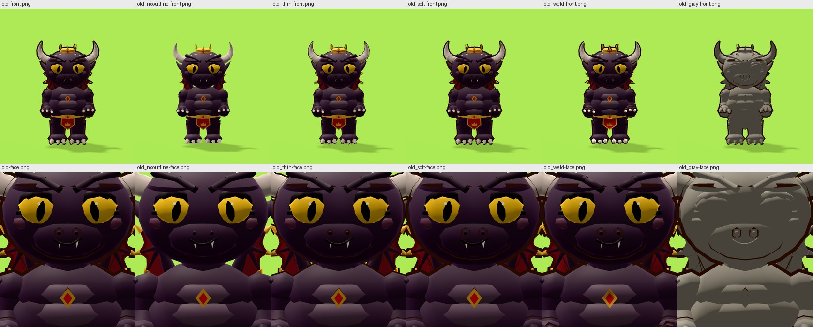
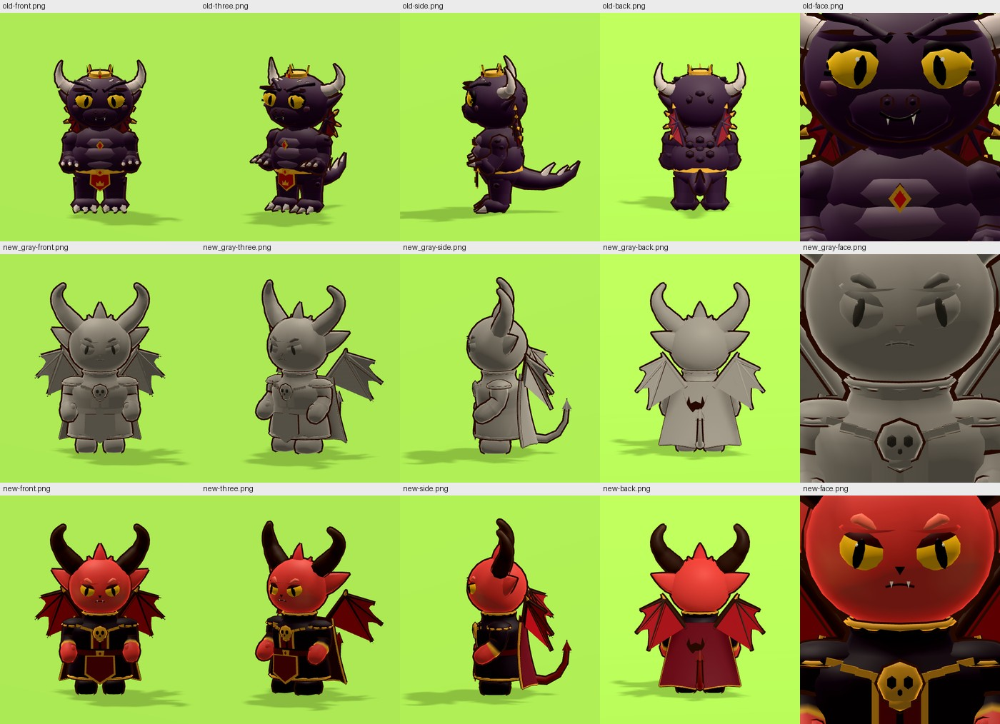
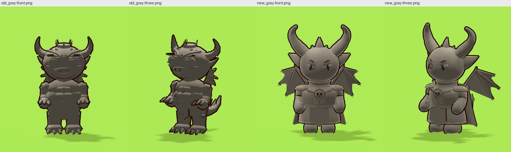
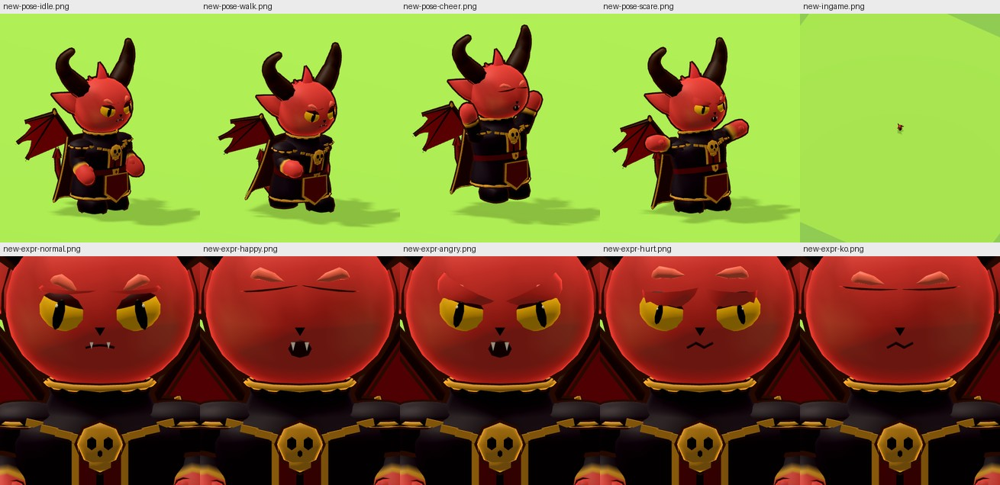
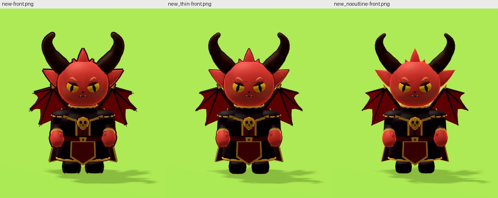
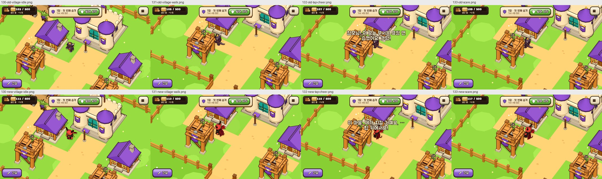
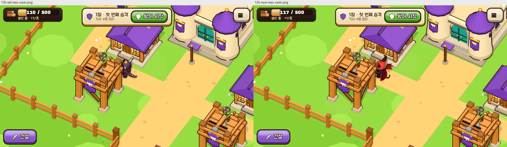
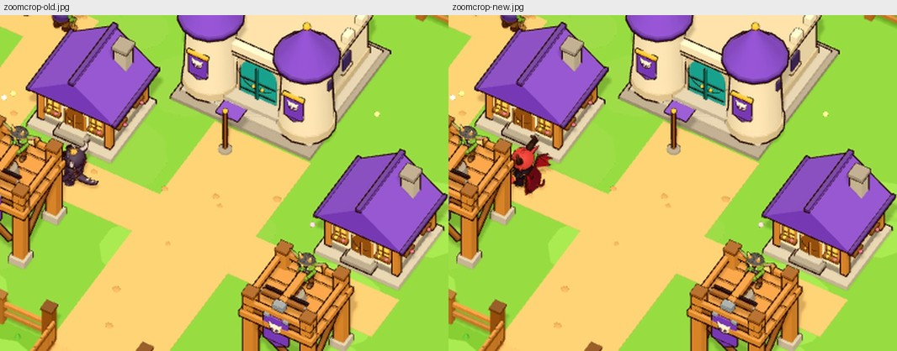

# 악마형 마왕 Lv.1 교체 후보 (6차, 테스트 씬 단계)

기준 그림: [`../concept/sheet-3-demon-king.jpg`](../concept/sheet-3-demon-king.jpg)(악마형 마왕 확정 디자인, Lv.1 "기본 형태"). 이 문서의 캡처는 모두 **실제 Godot 실행 결과**입니다(가상 디스플레이 + 소프트웨어 렌더러, 게임과 같은 조명·직교 카메라). 본 게임에는 아직 적용하지 않았고, 테스트 씬과 디버그 시나리오에서만 보입니다.

## 1. 기존 구현 진단(코드로 확인한 것)

| 항목 | 확인한 사실(파일) |
| --- | --- |
| 엔진·렌더러 | Godot 4.4.1-stable, `gl_compatibility`(`project.godot`), MSAA 3D 2× (`anti_aliasing/quality/msaa_3d=1`) |
| 생성 방식 | 커스텀 메시가 아니라 **코드로 조립한 기본 도형**(`CharGeo`: ellipsoid·tube·sweep·box·rounded_box·spline_tube…)을 하나의 `ArrayMesh`(표면 1개)로 모음. 모델 파일 없음 (`scripts/world/char_geo.gd`, `scripts/world/chars/imp_builder.gd`) |
| 분할 정도(기존 뿔이 Lv.1) | 머리 타원 20×11, 주둥이 타원 12×6, 몸통 초타원체 14×8 + 가슴 타원 12×6, 배 비늘판 3장(8×4), 팔다리는 구+원뿔대 조합, 눈 공막 12×6, 눈 테 10×5. 삼각형 5,189, 정점 5,293 |
| 법선·스무딩 | 도형마다 해석적 법선(타원체·관은 매끈, 상자는 평면). **도형끼리는 정점을 공유하지 않아** 겹치는 자리(어깨 구+팔 관, 배 비늘판, 주둥이)에 법선 불연속이 남음. `SurfaceTool`·`generate_normals()`는 쓰지 않음 |
| 정점 명암 | `CharGeo._vert`가 정점 색에 위(+16%)·아래(−20%) 명암을 **미리 굽고**, 그 위에 실시간 조명이 또 얹힘 → 둥근 면의 단차가 두 번 강조됨 |
| 외곽선 | 뒤집은 껍데기(`CharacterRig.outline_material`, `cull_front`, 폭 0.011 × 정점 알파). 메시 전체에 한 번 적용되지만 **도형마다 껍데기가 따로 부풀어** 도형이 만나는 자리마다 선이 생김(조립식 인상의 원인 중 하나) |
| 재질 | `CharacterRig.character_material()`: 정점 색 = 바탕색, 감싸는 확산광(LAMBERT_WRAP), roughness 0.62, specular 0.42, 림 0.3. 피부·눈·천·금속이 **같은 재질**(색만 다름) |
| 조명·환경 | 태양 1개(−58°/25°, 세기 0.5, 그림자 켬·흐림 1.5), 환경광 0.2, 선형 톤매핑, 채도 1.08·대비 1.06 (`world_view.gd _setup_environment`) |
| 애니메이션 | `Skeleton3D` 뼈(강체 스킨: 정점마다 뼈 1개)에 자세 함수가 회전·이동을 넣는 방식(`character_rig.gd pose_*`). Compatibility 렌더러라 스키닝은 CPU |
| 공유 코드 | `CharGeo`(도형), `CharacterRig`(리그·자세·표정·외곽선·재질)는 모든 캐릭터가 공유. 뿔이 Lv.1~4는 `ImpBuilder.build(lv)` 하나에서 레벨 분기 |

**문제 분류**

- A. 메시(형태·연결): 어깨·팔꿈치·무릎의 구 + 원뿔대 조합, 배 비늘판·주둥이·눈 테가 겹친 도형이라 경계가 보임. 눈은 머리 표면 앞으로 0.3 es 나와 있고 짙은 눈 테 타원이 그 뒤에 또 있어 단추처럼 보임. 흑룡형이라 주둥이가 길다. **→ 가장 큰 원인(회색 재질 실험으로 확인).**
- B. 법선·스무딩: 도형 사이 법선 불연속 + 정점에 구운 명암. 겹치는 위치 법선 평균(용접) 실험은 눈에 띄는 변화가 없음(도형끼리 정점 위치가 같은 곳이 거의 없어서).
- C. 외곽선·재질·조명: 도형 경계마다 외곽선, 림 라이트가 경계를 더 밝힘. 외곽선을 끄거나 얇게 해도 경계는 남음(아래 실험).
- D. 게임 크기 가독성: 기본 확대에서 뿔이 키 ≈ 45px. 세부는 보이지 않고 색 덩어리(머리색·옷색·뿔)만 읽힘.

추정(확인 못 함): 휴대전화 GPU에서의 외곽선·림 라이트 비용은 재지 않았습니다.

## 2. 렌더링 분리 실험(기존 모델, 형태는 그대로)



왼쪽부터: 기존 → 외곽선 없음 → 외곽선 0.005 → 림·반사 줄인 재질 → 법선 용접 → 회색 재질(정점 명암 없음). 한 번에 한 요소만 바꿨습니다(`tests/demon_lv1_scene.gd`의 variant).

- 외곽선을 없애도 도형 경계(어깨 구, 배 비늘판, 눈 테)는 그대로 보임 → 조립식 인상의 주된 원인은 A(메시).
- 법선 용접(1,757 / 5,293 정점의 법선이 바뀜)은 화면에서 차이가 거의 없음 → B 만으로는 해결되지 않음.
- 회색 재질에서 형태 문제가 가장 잘 보임: 비늘판·주둥이·눈 테가 따로 붙은 덩어리.
- 결론: 렌더링 설정만 고쳐서는 끝나지 않고, 이어지는 곡면으로 다시 만들어야 함.

## 3. 새 모델의 만드는 방식(공유 코드 무수정)

- `scripts/world/chars/demon_geo.gd` — `CharGeo`를 **상속**해 도형을 추가(기존 파일은 그대로):
  - `sculpt()`: 구 한 장을 방향 함수로 조각(눈두덩 패임·눈썹 능선·볼·짧은 주둥이·코끝·턱). 법선은 조각된 면의 접선에서 계산 → 얼굴 전체가 **한 면**.
  - `lathe()`: 회전체(목→어깨→허리→엉덩이)로 몸통·코트를 각각 한 장으로. 고리마다 뼈를 지정해 강체 스킨과 호환.
  - `limb()`: 어깨 속에서 손끝까지 **이어진 관**(마디마다 뼈·색·외곽선 세기가 바뀜). 관절에 구를 끼우지 않음. 몸속에 숨은 시작 고리는 외곽선 0.
  - 정점 명암 굽기 끔(`bake = 0`): 명암은 조명만으로.
- `scripts/world/chars/demon_lv1_builder.gd` — 악마형 Lv.1 본체. 뼈 이름·기준점·정면·`Cape` 뼈·`def` 키가 기존 뿔이와 같아 `CharacterRig`의 자세(걷기·환호·무서운 척)·표정·깜빡임·2차 움직임이 **수정 없이** 동작.
- 눈: 눈두덩 바닥보다 조금 안쪽에 눈알 중심을 두어 앞면만 살짝 나옴. 두꺼운 검은 테 대신 눈알 윗부분을 덮는 짙은 뚜껑(눈 뼈에 붙어 깜빡임·표정과 같이 움직임), 반사광은 작은 점 하나. 눈썹은 양 끝이 가늘어지는 능선 띠(표정으로 회전·내려가도 눈에 박히지 않음).
- 뿔: 첫 마디는 머리 겉면 법선 방향으로 곧게 나와 둥근 깃이 되고(뿌리가 표면을 스치지 않음), 그 뒤 베지어 곡선으로 바깥·위로 휨. 반지름을 매끈하게 흔든 마디 능선(틈 없음), 짙은 갈색.
- 의상: 코트 회전체 위에 곡면을 따라가는 띠(`front_strip`)로 버건디 가슴판·양옆 금 세로 테·어깨에서 걸쇠로 모이는 금 테 옷깃, 금 테 어깨 덮개, 걸쇠 아래 금 해골, 허리띠·버클, 단 테. 망토는 코트 등판 바깥에서 발목 가까이까지(금 테 가장자리, 등의 악마 문장), 앞치마는 허리띠 아래.
- 재질·외곽선: 기존 공유 재질과 외곽선 그대로 사용(공유 재질을 바꾸지 않음). 테스트 씬에 얇은 외곽선·외곽선 없음 변형도 둠.

변경·추가 파일: `scripts/world/chars/demon_geo.gd`, `scripts/world/chars/demon_lv1_builder.gd`(새 파일), `tests/demon_lv1_scene.gd`(테스트 씬·캡처), `tests/demon_lv1_checks.gd`(리그 검사), `scripts/debug/shot_driver.gd`에 시나리오 `demon_lv1` 추가(디버그 전용, 내보내기 제외), `docs/design/concept/sheet-3-demon-king.jpg`와 `crops/s3-*`. **기존 `imp_builder.gd`·`char_geo.gd`·`character_rig.gd`·다른 캐릭터·config 는 수정하지 않았습니다.**

**심사와 보완(3라운드).** 별도 심사 에이전트가 시안과 대조해 점수를 매기고 고칠 목록을 냈습니다.

| 라운드 | 심사 점수(일치 / 형태) | 지적 → 반영 |
| --- | --- | --- |
| 1차 | 6 / 6 | 막힘 4: 지퍼처럼 보이는 코트 앞면 → 금 테 옷깃·버건디 가슴판·어깨 덮개·긴 단·큰 해골 / 코트 속에 묻힌 망토 → 코트 등판 밖으로, 금 테·등 문장 / 머리 겉면을 스치는 뿔 뿌리 → 법선 방향 첫 마디 / 화남 표정에서 깨지는 눈썹·떠다니는 눈선 → 끝이 가는 눈썹, 눈알에 붙은 짙은 뚜껑. 소소한 8건(눈 크기·위치, 동공, 코, 볼, 귀, 날개, 앞치마, 불꽃 곁가지, 꼬리) 반영. 캡처의 고개 돌림(대기 t=0)도 지적 → t=1.43 로 통일 |
| 2차 | 6.5 / 6 | 코트·망토 해결, 뿔 뿌리·눈썹 부분 해결. 남은 지적 → 반영: 뿔을 굵은 숫양 뿔로(가운데 ≥ 60%, 뭉툭한 끝, 어두운 홈 5개, 15% 짧게, 뒤로 눕힘, 뿌리 깃 축소) / 눈썹 밑 줄무늬(조각 능선) 낮춤·눈썹 짧고 둥글게·연한 산호색 / 피부 산호색·볼 복숭아색 60%·망토 와인색 / 잎 모양 큰 귀(위·뒤로 기울임, 밝은 안쪽) / 꼬리는 망토 단 아래로, 등 문장을 악마 머리꼴 밝은 붉은색으로 위에 / 날개 25~30° 뒤로 / 눈 분할 상향 / 해골 걸쇠를 가슴에 붙임 / 엄지를 주먹에 묻음 |
| 3차 | (심사 없음: 제작자 확인) | 아래 결과 캡처. 심사자가 요청한 "웃음의 ∩ 눈·기절의 X 눈"은 별도 기하가 필요해 미반영 |

## 4. 결과(같은 카메라·조명·해상도)

A 기존 모델 / C 새 모델 회색 재질 / D 새 모델 최종:



회색 재질 형태 비교(기존 vs 새):



새 모델의 동작(대기·걷기·환호·무서운 척·게임 크기)과 표정(보통·웃음·화남·아픔·기절):



외곽선 변형(기존 폭 0.011 / 얇게 0.005 / 없음):



실제 게임(디버그 시나리오 `demon_lv1`, 게임 코드는 그대로 두고 뿔이 노드의 리그만 바꿔 끼움). 위 = 기존, 아래 = 후보: 대기 → 산책 → 누르기(환호 + 말풍선) → 무서운 척:



최대 확대와 기본 확대(가운데 2배 확대 자름):




## 5. 검증

- `tests/demon_lv1_checks.gd`(헤드리스): 기존 뿔이 Lv.1과 후보에 같은 검사 → **89 통과, 0 실패**. 관절·얼굴 뼈·망토 뼈, 대기 최저점(후보 0.005), HEIGHT 0.920(0.85~1.0), 정면 −Z, 오른손 +X, 걷기 접지(−0.03~0.035)·몸 위아래·무릎 굽힘, 환호 중 최저점, 무서운 척 최저점(공통 자세가 몸을 좌우로 기울여 바깥 장화·망토 모서리가 내려감, 기준 −0.05), 표정 4종 변화, 6초 안 깜빡임, 망토 2차 움직임, 삼각형 예산, 그리기 호출 1, 결정적 메시·자세.
- 기존 검사도 변화 없음: 캐릭터 검사 520, 규칙 검사 605 통과(다른 캐릭터·뿔이 Lv.2~4 무변경).
- 실제 게임 시나리오(`--scenario=demon_lv1`): 산책·누르기 판정(true)·말풍선(true)·환호·무서운 척 모두 후보에서도 동작. 관통: 테스트 씬 캡처에서 망토·날개·꼬리·얼굴의 눈에 띄는 관통 없음(걷기·환호·무서운 척 프레임 기준, 전 프레임 검사는 아님).
- 성능(측정값): 모델 단위 삼각형 5,189 → 6,000(+16%, 예산 6,000 안), 정점 5,293 → 4,831(−9%, CPU 스키닝 부담 감소), 그리기 호출 1 → 1. 장면 FPS 는 따로 재지 않았습니다(캐릭터 1명 차이라 소프트웨어 렌더러 오차보다 작습니다).

## 6. 시안과 아직 다른 것 / 남은 개선

- 눈: 시안의 날카로운 아몬드보다 둥근 편(기울기·윗 뚜껑으로 근사). "웃음"은 눈을 눌러 만든 가로선이라 시안의 ∩ 모양이 아니고, "기절"도 같은 선(시안·심사자가 말한 X 눈은 별도 기하 필요).
- 눈썹은 시안의 두툼한 능선보다 가는 띠. 표정 회전(공통 리그)으로 바깥 끝이 머리 윤곽 밖으로 조금 나올 수 있음.
- 코트 앞트임의 V 폭이 시안보다 좁고(해골 폭 정도), 양옆 금 세로 테는 정면에서 가늘게만 보임. 소매 금 테·장갑 디테일은 소맷단 고리로 단순화.
- 뿔: 2차 심사 뒤 굵게·홈을 넣었으나 심사자가 다시 보지 않았음(3차는 제작자 확인만). 홈은 색과 반지름으로만 표현.
- 날개막에 어두운 테두리 선이 없고 손가락 사이 패임이 얕음. 뿌리 쪽 막은 삼각 판 하나.
- 뒷모습의 문장은 평판이라 망토가 흔들릴 때 함께 휘지 않음(같은 Cape 뼈라 위치는 따라감).
- 무서운 척 자세(공통)의 좌우 기울기에서 망토·장화 모서리가 지면 아래로 최대 4~5cm 내려감(기준 −5cm 안).
- 실기기 미검증, 장면 FPS 미측정.

## 7. 실행 방법과 되돌리기

```bash
# 테스트 씬(기존 변형과 후보를 같은 조건으로 캡처; variant 는 쉼표로 여러 개)
xvfb-run -a godot --path . --rendering-driver opengl3 --resolution 420x480 --script res://tests/demon_lv1_scene.gd -- \
    --out=/tmp/demon --variant=old,old_gray,new_gray,new
# 리그 검사(헤드리스)
godot --headless --path . --script res://tests/demon_lv1_checks.gd
# 실제 게임에서 기존 → 후보 순서로 캡처(게임 코드 무수정)
xvfb-run -a godot --path . --rendering-driver opengl3 --resolution 1280x720 -- \
    --shots=/tmp/demon-game --scenario=demon_lv1 --no-tutorial --no-story --save-dir=user://shots/ --fresh --no-focus-pause
```

본 게임은 여전히 `CharacterRig.imp(lv)` → `ImpBuilder.build(lv)`(기존 뿔이)를 씁니다. 후보를 적용하려면 `CharacterRig.imp()`에서 Lv.1 일 때 `DemonLv1Builder.build()`를 돌려주도록 한 줄을 바꾸면 되고(승인 뒤), 되돌리기는 그 한 줄을 원래대로 두면 됩니다. 새 파일을 지워도 기존 게임은 영향을 받지 않습니다.
